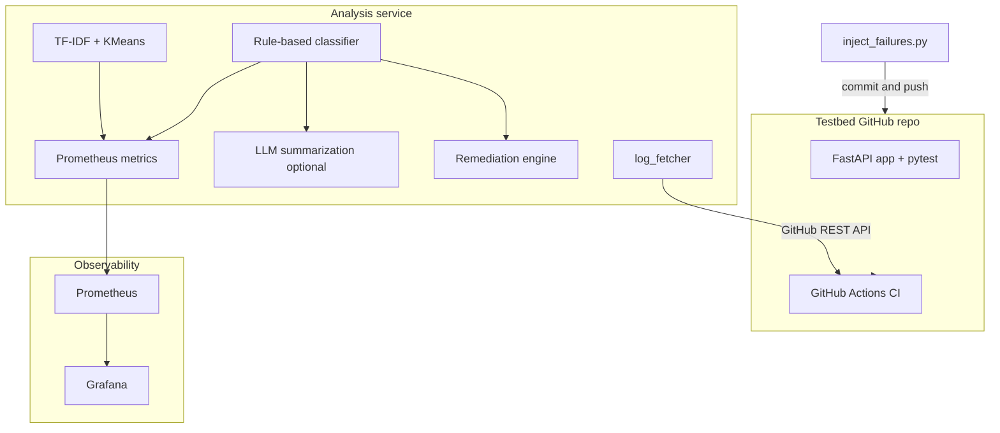

# CI Failure Analysis & Remediation Platform

A developer productivity system that automatically **classifies**, **clusters**, and **triages** CI pipeline failures — reducing manual log debugging time from **~10 minutes to ~4 minutes** per failure (in controlled testbed scenarios).

Built with **Python**, **FastAPI**, **GitHub Actions**, **scikit-learn**, and **Grafana**.

---

## Table of contents

- [Overview](#overview)
- [Architecture](#architecture)
- [Project structure](#project-structure)
- [Prerequisites](#prerequisites)
- [Quick start](#quick-start)
- [Environment variables](#environment-variables)
- [Workflow: testbed → injector → analysis](#workflow-testbed--injector--analysis)
- [How failure injection works](#how-failure-injection-works)
- [How classification works](#how-classification-works)
- [How clustering works](#how-clustering-works)
- [Metrics tracked](#metrics-tracked)
- [Results (testbed study)](#results-testbed-study)
- [Run online (deploy)](#run-online-deploy)
- [API reference](#api-reference)
- [Testing](#testing)
- [Extending the project](#extending-the-project)
- [License](#license)

---

## Overview

CI pipelines fail in predictable patterns. Most teams debug each failure individually — opening logs, scrolling through stack traces, identifying root cause manually. This system automates that triage process.

### What it does

1. Runs controlled CI pipelines with injected failure modes via GitHub Actions (optional testbed repo).
2. Pulls failure logs automatically via the GitHub API.
3. Classifies each failure using **rule-based parsing** (regex pattern matching).
4. Groups similar failures into clusters using **TF-IDF + KMeans** (k tuned via silhouette score in range 3→8; typical outcome **k = 6** clusters in the reference study).
5. Suggests **automated remediation** (test retries, dependency pinning, env fixes).
6. Tracks **MTTR**, **failure frequency**, and **flakiness** metrics in Grafana (Prometheus scrape).

### What it does not do

- This is **not** a production incident management system.
- **MTTR** is measured in a **controlled testbed** environment, not across a real engineering team.
- The **LLM** component is **assistive only** — classification is **rule-based**.

---

## Architecture



---

## Project structure

```
cl_failure_pipeline/
├── testbed/                        # Controlled CI testbed (can be a separate GitHub repo)
│   ├── app/main.py
│   ├── tests/
│   ├── requirements.txt
│   └── .github/workflows/ci.yml
├── injector/
│   ├── inject_failures.py
│   └── failure_configs/
├── analysis/
│   ├── main.py
│   ├── log_fetcher.py
│   ├── classifier.py
│   ├── clustering.py
│   ├── remediation.py
│   ├── llm_summarizer.py
│   └── metrics.py
├── monitoring/
│   ├── prometheus.yml
│   └── grafana/
├── docker-compose.yml
├── Dockerfile
├── requirements.txt
└── README.md
```

---

## Prerequisites

| Requirement | Notes |
|-------------|--------|
| Python | 3.10+ |
| Docker + Compose | For analysis + Prometheus + Grafana together |
| GitHub account + PAT | `repo` and `actions:read` on the **testbed** repository |
| OpenAI API key | Optional — LLM summarization only |

---

## Quick start

### Clone

```bash
git clone https://github.com/poojaa-12/ci-failure-analysis.git
cd ci-failure-analysis
```

### Virtualenv

```bash
python -m venv .venv
source .venv/bin/activate          # Windows: .venv\Scripts\activate
pip install -r requirements.txt
```

### Environment variables

```bash
export GITHUB_TOKEN=your_personal_access_token
export GITHUB_REPO=your-username/your-testbed-repo
export OPENAI_API_KEY=your_openai_key    # optional
```

### Run the full stack (API + Prometheus + Grafana)

```bash
docker compose up --build
```

| Service | URL |
|---------|-----|
| Analysis API | http://localhost:8000 |
| Prometheus metrics | http://localhost:8001/metrics |
| Prometheus UI | http://localhost:9090 |
| Grafana | http://localhost:3000 (default login `admin` / `admin` from compose) |

### Run API only (local)

```bash
uvicorn analysis.main:app --reload --host 0.0.0.0 --port 8000
```

To skip binding the metrics port during development/tests:

```bash
export DISABLE_METRICS_SERVER=1
```

---

## Environment variables

| Variable | Required | Purpose |
|----------|----------|---------|
| `GITHUB_TOKEN` | For `/failed-runs` and log download | GitHub PAT |
| `GITHUB_REPO` | For `/failed-runs` | `owner/repo` of the testbed |
| `OPENAI_API_KEY` | No | Optional LLM summaries on `/analyze` |
| `METRICS_PORT` | No | Default `8001` |
| `DISABLE_METRICS_SERVER` | No | Set to `1` to skip Prometheus HTTP server |
| `TESTBED_PATH` | No | Injector: path to testbed clone (default `./testbed`) |
| `INJECTION_BRANCH` | No | Injector: default `failure-injection` |
| `INJECTION_COUNT` | No | Injector: default `75` |

---

## Workflow: testbed → injector → analysis

1. **Testbed** — Push `testbed/` (or a separate repo) to GitHub; confirm CI is green once.
2. **Inject** — From a machine with git credentials to the testbed:

   ```bash
   export TESTBED_PATH=/path/to/testbed-clone
   python injector/inject_failures.py --seed 42
   ```

   Use `--dry-run` to print modes without git writes.

3. **Analyze** — `POST /analyze` with log text, or `GET /failed-runs` to pull recent failures (requires token + repo).

4. **Cluster** — `POST /cluster` with a JSON array of log strings.

5. **Dashboards** — Open Grafana and use the provisioned **CI Failure Analysis** dashboard (`monitoring/grafana/dashboards/dashboard.json`).

---

## How failure injection works

| Mode | What breaks | Error signature |
|------|-------------|-----------------|
| Flaky test | `random.random() > 0.3` style assertion | `AssertionError` — non-deterministic |
| Dep install | FastAPI + Pydantic mismatch in `requirements.txt` | pip / resolution errors |
| Dep runtime | Bad pins / imports | `ImportError` / `ModuleNotFoundError` |
| Env config | Missing `os.environ["MISSING_VAR"]` | `KeyError` / missing env |
| Assertion | Intentional failing test | `AssertionError` — deterministic |

---

## How classification works

Classification runs **before** clustering. Regex patterns are evaluated in a **fixed order** (flaky → dependency install → dependency runtime → env → assertion). First match wins; otherwise `unknown`.

---

## How clustering works

| Step | Detail |
|------|--------|
| Input | List of raw failure log strings |
| Vectorization | TF-IDF, `ngram_range=(1,2)`, `max_features=2000`, English stop words |
| Tune k | Try **k = 3 … 8** (adjusted when sample size is small), pick best **silhouette** score |
| Cluster | KMeans, `random_state=42` |
| Representatives | Closest log to each centroid |

**Why TF-IDF + KMeans (not embeddings):** CI logs repeat structured signatures (`ModuleNotFoundError`, `AssertionError`). TF-IDF is fast, interpretable, and easy to debug. Embeddings help when messages are more semantically varied.

---

## Metrics tracked

| Metric | What it measures | Why it matters |
|--------|------------------|----------------|
| MTTR (triage time) | Time to classify and suggest remediation | Primary productivity metric (testbed) |
| Failure frequency | Count per `failure_type` | Surfaces systemic issues |
| Flakiness rate | Failures classified as flaky | Prioritizes reliability work |
| Cluster distribution | Assignments per cluster | Shows dominant failure themes |

**Note on MTTR:** The **~10 min → ~4 min** improvement is measured in a **controlled testbed** by comparing manual triage vs system-assisted triage over many runs. It is **not** production team MTTR.

Prometheus names:

- `ci_failures_total{failure_type="..."}`
- `ci_triage_duration_seconds` (histogram)
- `ci_failure_cluster_assignments_total{cluster_id="..."}`

---

## Results (testbed study)

Reference numbers from the original controlled experiment (your mileage will vary):

| Metric | Value |
|--------|--------|
| Total pipeline runs | 75 |
| Failure clusters identified | 6 |
| Optimal k (silhouette-tuned) | 6 (from range 3–8) |
| Manual triage time (baseline) | ~8–12 min per failure |
| System-assisted triage time | ~3–5 min per failure |
| Unique triage passes needed | 6 (one per cluster) vs 75 individual |

---

## Run online (deploy)

The analysis service is a standard **FastAPI** + **Docker** app. Typical options:

- **Fly.io**, **Railway**, **Render**, **Google Cloud Run**, **AWS App Runner** — deploy the `Dockerfile`, set `GITHUB_*` env vars, expose port **8000**.
- **Grafana + Prometheus** — run the full `docker compose` stack on a VM, or use **Grafana Cloud** / managed metrics for dashboards.

Some hosts only expose **one** HTTP port; in that case run the API only, or use a platform that allows **8000** (app) and **8001** (metrics) separately.

---

## API reference

**Health**

```http
GET /health
```

**Classify + remediate**

```http
POST /analyze
Content-Type: application/json

{"run_id": "123", "log_text": "...", "include_llm_summary": false}
```

**Batch clustering**

```http
POST /cluster
Content-Type: application/json

["log line 1", "log line 2"]
```

**Fetch recent failed workflow logs** (requires `GITHUB_TOKEN` + `GITHUB_REPO`)

```http
GET /failed-runs?limit=10
```

---

## Testing

```bash
pip install -r requirements.txt
pytest
```

On GitHub, **Actions** runs the same test suite on push and pull requests to `main` (see [`.github/workflows/ci.yml`](.github/workflows/ci.yml)).

---

## Extending the project

- **Embedding clustering** — Replace TF-IDF with `sentence-transformers` for more semantic variety.
- **Drift detection** — Alert when cluster distribution shifts over time.
- **PR comments** — Post classification results on failing PRs via the GitHub API.
- **Real repos** — Point `GITHUB_REPO` at any repo with Actions logs.

---

## License

MIT — see [LICENSE](LICENSE).
